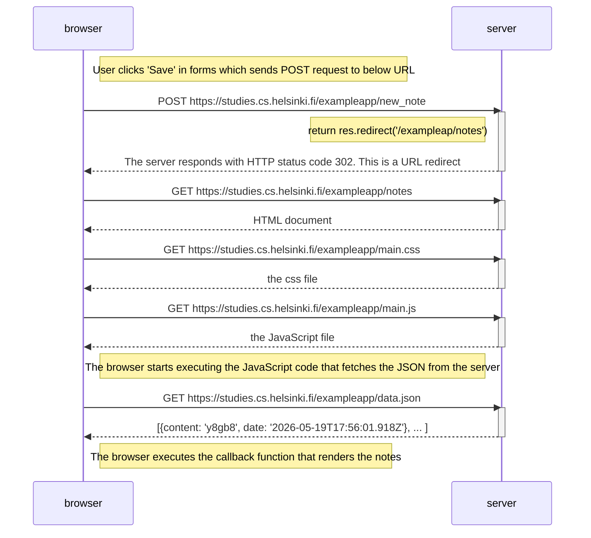

```mermaid
sequenceDiagram
    Note right of browser: User clicks 'Save' in forms which sends POST request to below URL
    browser ->>server: POST https://studies.cs.helsinki.fi/exampleapp/new_note  
    activate server
    
    Note left of server: return res.redirect('/exampleap/notes')
  
    server -->>browser: The server responds with HTTP status code 302. This is a URL redirect
    deactivate server
    browser->>server: GET https://studies.cs.helsinki.fi/exampleapp/notes
    activate server
    server-->>browser: HTML document
    deactivate server

    browser->>server: GET https://studies.cs.helsinki.fi/exampleapp/main.css
    activate server
    server-->>browser: the css file
    deactivate server

    browser->>server: GET https://studies.cs.helsinki.fi/exampleapp/main.js
    activate server
    server-->>browser: the JavaScript file
    deactivate server

    Note right of browser: The browser starts executing the JavaScript code that fetches the JSON from the server

    browser->>server: GET https://studies.cs.helsinki.fi/exampleapp/data.json
    activate server
    server-->>browser: [{content: 'y8gb8', date: '2026-05-19T17:56:01.918Z'}, ... ]
    deactivate server

    Note right of browser: The browser executes the callback function that renders the notes
```
