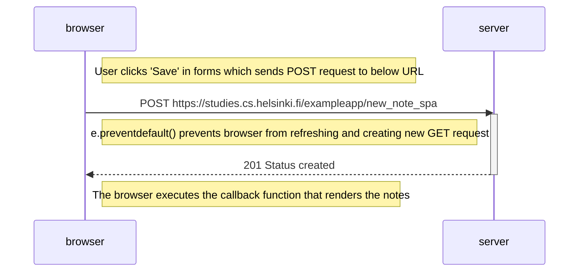

```mermaid
sequenceDiagram
    Note right of browser: User clicks 'Save' in forms which sends POST request to below URL
    browser->>server: POST https://studies.cs.helsinki.fi/exampleapp/new_note_spa
    activate server
    Note left of server: e.preventdefault() prevents browser from refreshing and creating new GET request
    server-->>browser: 201 Status created
    deactivate server

    Note right of browser: The browser executes the callback function that renders the notes
```
